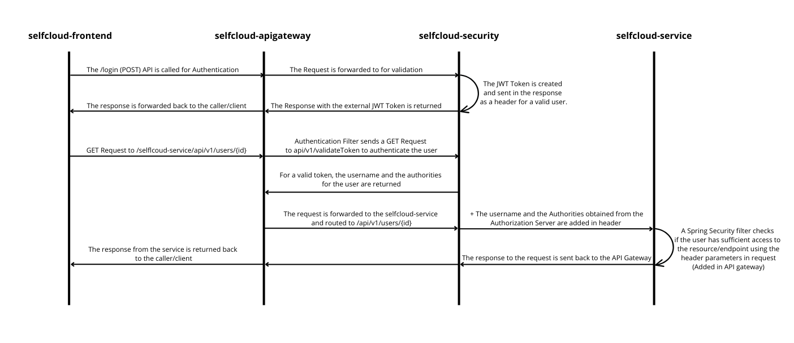

# selfcloud-apigateway

Acts as the main gateway, handling external requests and routing them to the appropriate internal microservices. It also provides a unified API interface for the application.

### Schema

The JWT is used for authentication and authorization in the Selfcloud environment. The schema below illustrates the method of operation




### RouteConfiguration

The configuration of routes is defined in the [RouteConfiguration](src/main/java/pl/selfcloud/apigateway/config/RouteConfiguration.java) class.

If a user wants to log in or sign up, is redirected to the appropriate services of _selcloud-security_."
```java
        .route("authentication-route", r -> r.path("/auth/**")
            .filters(f -> f.prefixPath("/api/v1"))
            .uri("http://" + host +":8090"))
```
After successful authentication, the external JWT token 
(it contains only uuid of user) 
is returned to the user.
This token is required for communication with internal services 
and is validated by a specific filter.

```java
        .route("announcement-route", r -> r.path("/announcements/**")
            .filters(f ->
                f.prefixPath("/api/v1")
                    .filter(jwtValidationGatewayFilterFactory.apply(
                        new JwtValidationGatewayFilterFactory.Config())))
            .uri("http://" + host + ":8091"))
```

### JwtValidationGatewayFilterFactory

This class provides the core functionality of the _selfcloud-apigateway_.

Api gateway extracts the token from the request and forwards it
to the _/auth/validateToken_ endpoint of _selfcloud-security_,
where the token is validated.

After successful validation, the response is returned,
containing the user's privileges. 
These privileges are added to the user's request and 
forwarded to the target microservices.

```java
String url = "http://" + host + ":8090/api/v1/auth/validateToken";

return webClient.get()
          .uri(url)
          .header(HttpHeaders.AUTHORIZATION, externalBearerToken)
          .retrieve()
          .bodyToMono(ConnValidationResponse.class)
          .flatMap(validationResponse -> {
            Collection<MyGrantedAuthority> authorities = validationResponse.getAuthorities();
            List<String> authStr = authorities.stream().map(MyGrantedAuthority::getAuthority).toList();
            
            ServerHttpRequest modifiedRequest = exchange.getRequest().mutate()
                .header("username", validationResponse.getUsername())
                .header("authorities", String.valueOf(authStr))
                .header("userId", String.valueOf(validationResponse.getUserId()))
                .build();

            ServerWebExchange modifiedExchange = exchange.mutate().request(modifiedRequest).build();
            return chain.filter(modifiedExchange);
          })
          .onErrorResume(e -> {
            log.error("Error during token validation", e);
            return chain.filter(exchange);
          });
```


